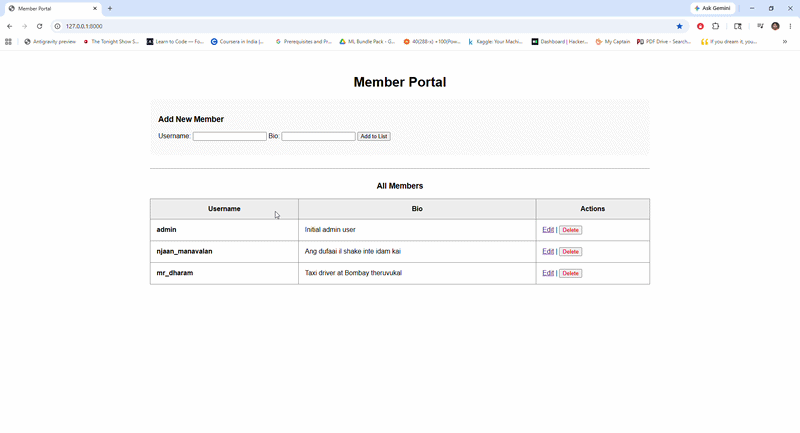

# 📓 Learning HTTP Requests and Responses 

This is the technical record of everything I learned during this project. 

### **The Journey:**
1.  **Step 1: The Hello API (`hello_api.py`)**: My very first step. I learned how to create a basic "Hello World" endpoint and understood how the server responds to a simple GET request using FastAPI.
2.  **Step 2: The Member Portal (`profile_api.py`)**: This was my "advanced" project. While I started small, I learned **everything else** listed in this report, CRUD, Persistence, HTML Forms, and advanced Python logic, by building this portal using FastAPI.

---

## 🏗️ 1. Distributed Systems: Client vs. Server
The architecture is based on the separation of two independent programs communicating over a network:

*   **The Server**: When the client asks for information, it **"serves"** it, and hence the name.
*   **The API (Application Programming Interface)**: A program in the server that enables the client to access and manipulate data in the server that it has access to. It acts as the interface between my requests and the server's internal logic. 
    *   🎬 ***The Kaththi Analogy***:
        *   **HTML Code/server**: The "Blueprint Paper" with all the data.
        *   **The Browser**: The "Viewer" (Vijay) who reads and interprets the paper.
        *   **The DOM**: The "Live House" that is built and exists in reality based on the paper.
        *   **The API**: The "Skeleton" that makes the house possible by 'extracting' necessary info from the server.

---

## 📡 2. The Request-Response Cycle
Every interaction on the web is a two-part conversation:
1.  **The Request**: Sent by the Browser (Client) to the Server.
2.  **The Response**: Sent by the Server back to the Browser. (In Python, this is usually the `return` value of the function).

**Status Codes**:
*   **200**: Request was **PERFECT OK!** 👌
*   **404**: Page not found.

---

## 🛠️ 3. Backend Infrastructure (FastAPI)
*   **FastAPI Instance (`app = FastAPI()`)**: This is me creating an "instance" of FastAPI. I am telling the server that the API used here is FastAPI.
*   **Decorators (`@app.get("/")`)**: These "sense" when a specific page or URL is reached and trigger the code below them.
*   **f-strings (`f"Hello, {name}"`)**: A way to inject variables directly into a string of text using curly braces `{ }`.
*   **Type Hints (`name: str`)**: Telling the computer that a variable MUST be a specific type (like text).

---

## 📡 4. HTTP Methods (The Actions)
I learned to manage data through standard actions that define the intent of the request:

1.  **GET**: To "get" information from the server. It does not modify the server data. 
    *   *Example*: Get the info of an employee from the employee database.
2.  **POST**: To "post" (submit) data to create new records on the server. 
    *   *Example*: Add the data of a new employee to the database.
3.  **PUT**: To "put" (submit) data to update or edit existing records. 
    *   *Example*: Update the salary or bio of an employee.
4.  **DELETE**: To remove a specific piece of data from the server.
    *   *Example*: Delete the record of an employee who left.

When you type an address and hit Enter, the browser **always** sends a GET request. You don't "go to" a POST route to read info; you send info to a POST route, and it sends back a confirmation.

---

## 📄 5. Data Formats & Persistence
*   **JSON (JavaScript Object Notation)**: A universal format (language) that almost all Python, JavaScript, etc., would understand. It’s the perfect "envelope" for sending data.
*   **The JSON Translator (`import json`)**: I need this to translate a living Python dictionary in RAM into a JSON-language text string so it can be saved on the Hard Drive.
*   **Persistence**: Moving data from temporary RAM to the permanent Hard Drive so it survives server restarts. I stored my database as a `.json` file.
*   **OS Module (`import os`)**: Stands for Operating System. I imported this to check if my database file exists before trying to read it.

---

## 🐍 6. Python Logic & Context Managers
*   **Context Manager (`with open() as f:`)**: Like a door which can **"automatically close."** The file is opened and closed at the exact instant it's needed. Once it loads the data, the file is "automatically closed" so it stays safe.
*   **The `next()` Function**: A for loop and if statement in one line. 
    *   *Example*: `target_user = next((u for u in user_database if u["username"] == username), None)`
    *   This tells Python: *"Store the first user that satisfies the condition. If nothing satisfies it, return None."*
---

## 🎨 7. Frontend: HTML & UI
*   **HTML Forms**: 
    *   Clicking "Save Changes" is basically a **POST** request that will redirect you to a new page where a confirmation message is shown.
    *   *Note*: HTML forms do **not** support PUT or DELETE. The only available requests for them are **GET and POST**.
*   **Dynamic UI**: I used Python to build a long string of HTML rows using a loop and then "pasted" it into the main page using an f-string.

---

